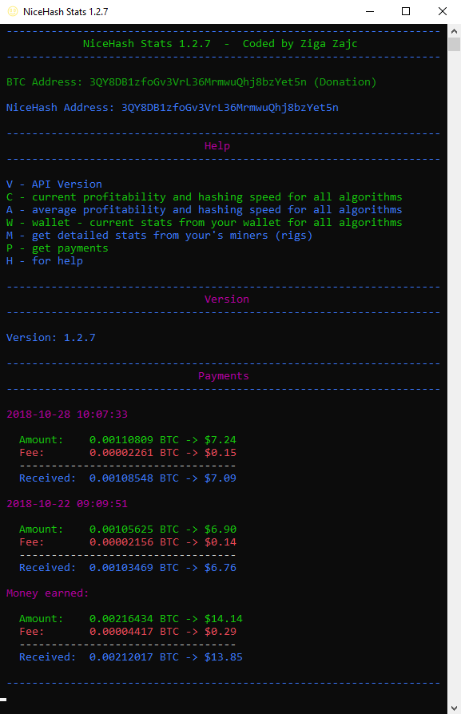
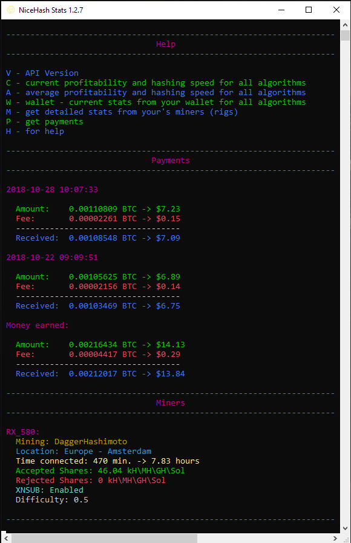
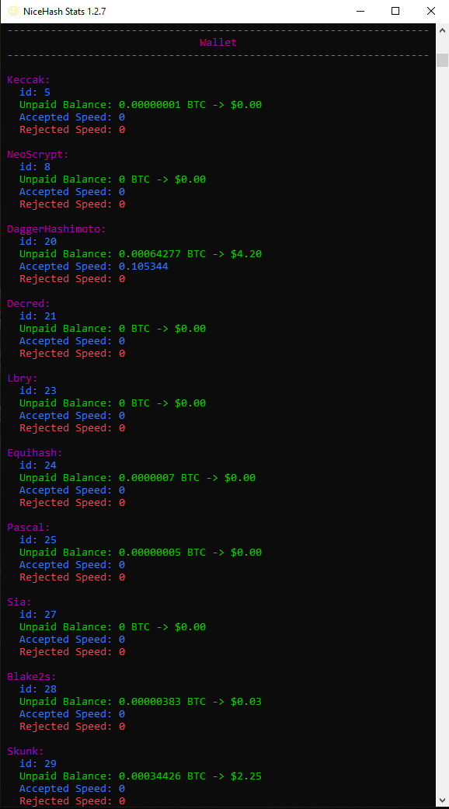
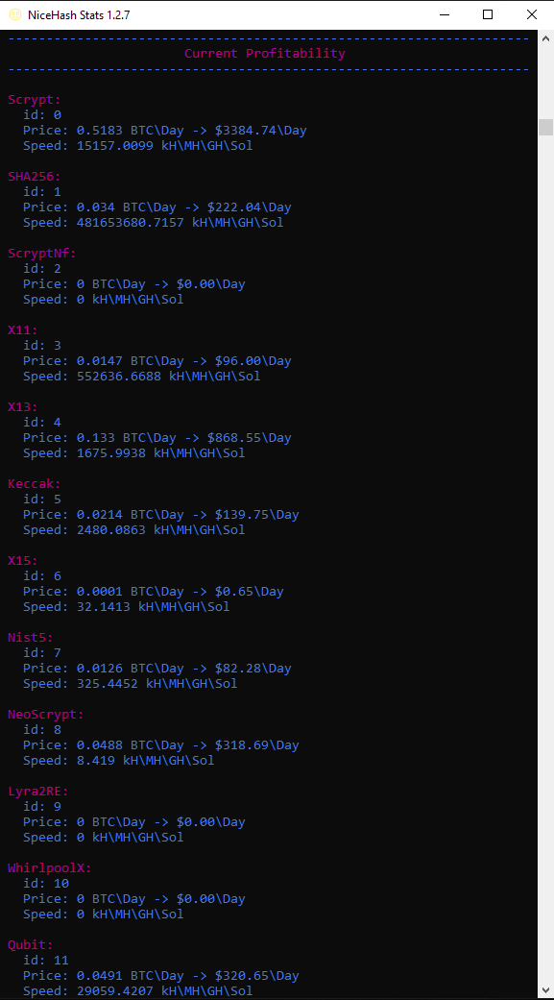

# NiceHash Stats

## Description
Simple way to control **miner**, **wallet**, **prices**... with just **171 KB** application!

## Donation
Every Satoshi count...
You can donate me to my Ledge Nano S Wallet: **3PX1UeQpvnfU8HMPzWh73ksNsrTQuCqMyh** (BTC Wallet)

## Download
You can download **NiceHash Stats.exe** from *NiceHash Stats\bin\Release* or you can download project and compile it with **Visual Studio**.

## EULA
You have all rights to edit NiceHash Stats.
But if you want to publish it you need to write my name, surname (Ziga Zajc) and write my BTC wallet:
**3PX1UeQpvnfU8HMPzWh73ksNsrTQuCqMyh**

## Images

